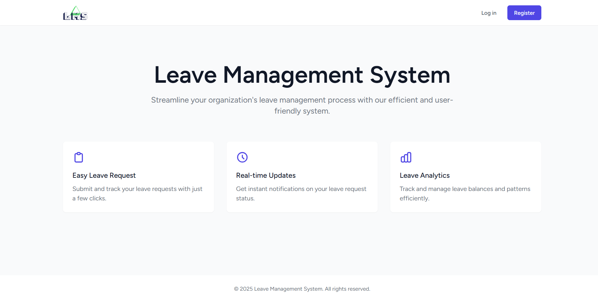

# Leave Management System

A modern web application built with Laravel and Vue.js that streamlines the process of managing employee leave requests. This system provides an efficient way to handle leave applications, approvals, and notifications.



## Features

👥 **User Role Management**
  - Admin and Employee role separation
  - Role-based access control
  - Secure authentication system

📝 **Leave Management**
  - Multiple leave types (Sick, Vacation, Personal, Emergency, etc.)
  - Date range selection
  - Reason documentation
  - Status tracking (Pending, Approved, Rejected)

📧 **Notifications**
  - Email notifications for leave status updates
  - Real-time status changes
  - Admin remarks support

📊 **Dashboard**
  - Overview of leave statistics
  - Status-wise leave counts
  - Comprehensive leave history

## Tech Stack

- **Backend:** Laravel 10.x
- **Frontend:** Vue.js 3, Inertia.js
- **Styling:** Tailwind CSS
- **Database:** MySQL
- **Email:** Laravel Mail with SMTP

## Installation

1. **Clone the repository**
```bash
git clone https://github.com/yourusername/leave-management-system.git
cd leave-management-system
```

2. **Install Dependencies**
```bash
composer install
npm install
```

3. **Environment Setup**
```bash
cp .env.example .env
php artisan key:generate
```

4. **Configure Database**
- Update .env file with your database credentials
```bash
DB_CONNECTION=mysql
DB_HOST=127.0.0.1
DB_PORT=3306
DB_DATABASE=your_database_name
DB_USERNAME=your_username
DB_PASSWORD=your_password
```

5. **Configure Email**
- Update .env file with your SMTP settings
```bash
MAIL_MAILER=smtp
MAIL_HOST=smtp.gmail.com
MAIL_PORT=587
MAIL_USERNAME=your-email@gmail.com
MAIL_PASSWORD=your-app-password
MAIL_ENCRYPTION=tls
MAIL_FROM_ADDRESS=your-email@gmail.com
MAIL_FROM_NAME="${APP_NAME}"
```

6. **Run Migrations and Seeders**
```bash
php artisan migrate --seed
```

7. **Build Assets**
```bash
npm run dev
```

8. **Start the Server**
```bash
php artisan serve
```

## Default Users

After running seeders, you can login with these credentials:

- **Admin User:**
  - Email: admin@example.com
  - Password: password

- **Regular User:**
  - Email: user@example.com
  - Password: password

## Contributing

1. Fork the repository
2. Create your feature branch (`git checkout -b feature/AmazingFeature`)
3. Commit your changes (`git commit -m 'Add some AmazingFeature'`)
4. Push to the branch (`git push origin feature/AmazingFeature`)
5. Open a Pull Request

## License

This project is licensed under the MIT License - see the [LICENSE](LICENSE) file for details.

## Acknowledgments

- Laravel Framework
- Vue.js
- Tailwind CSS
- All contributors who helped in building this system
